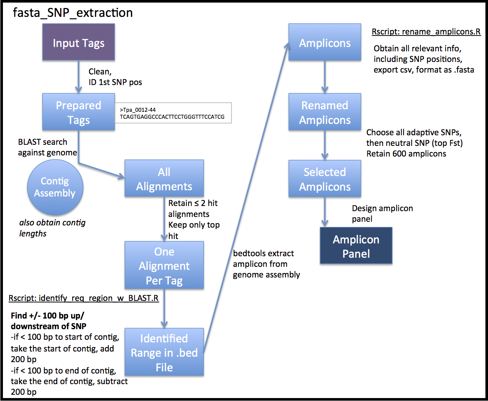

# fasta_SNP_extraction
Extract a section of a reference genome assembly flanking a SNP from an input tag.   

Designed as part of a project with the Molecular Genetics Laboratory (MGL) at the Fisheries and Oceans Canada Pacific Biological Station (PBS).      

Warning: this pipeline is provided as is, without any guarantee of usefulness.    

All scripts are to be run from the main folder.    
General overview:   
0. Prepare input data (project-specific)
1) BLAST search the genome
2) Identify target range
3) Obtain target range
4) Rename amplicons
5) Reverse complement necessary amplicons
6) Select specific amplicons




### 0.1 Input information (example from Eulachon project)    
Put original files in `02_input_data`:    
`tpac_adaptive_loci_2018-03-22.csv`     
`tpac_neutral_loci_2018-03-22.csv`

Original format:    
```
Loci_name,Loci_Sequence,SNP_location
Tpa_0002,GTTCGTTCAGTCTAAAGAGAATAATAGGACCGGGAGGTTTGTACTTATGTAATAGACACAC[A/T]CACATACATATGCGCA,62
```

Put genome contig assembly in `02_input_data/genome`:    
`tpac_assembly/tpac_assembly_v1/tpac-contigs_min200.fa`   

#### 0.1a Prepare input loci files (example from Eulachon project)
Concatenate input files, remove header, remove rest of line after first colon (occurs when multiple SNP locations):     
`cat 02_input_data/tpac_adaptive_loci_2018-03-22.csv 02_input_data/tpac_neutral_loci_2018-03-22.csv | grep -vE 'Loci.name' - | awk -F":" '{ print $1 }' - > 02_input_data/input_loci.csv`

Determine the **position of the first SNP in the locus** based on presence of a square bracket:         
`awk -F, '{ print $2 }' 02_input_data/input_loci.csv | while read l ; do echo $l | cut -d[ -f1 | wc -c ; done > 02_input_data/first_snp_position.csv`

Add position to the original file   
`paste -d, 02_input_data/input_loci.csv 02_input_data/first_snp_position.csv > 02_input_data/input_loci_w_pos.csv`   

Select columns of interest and put into FASTA format:      
`awk -F"," '{ print ">"$1"-"$4"\n"$2 }' 02_input_data/input_loci_w_pos.csv > 02_input_data/input_loci_w_pos.fa`   

Remove characters ([]/) to prevent issues with BLAST:    
`sed 's/\[//g' 02_input_data/input_loci_w_pos.fa | sed 's/\///g' - | sed 's/]//g' - > 02_input_data/input_loci_w_pos_no_badchar.fa`

Rename and delete intermediate files
`mv 02_input_data/input_loci_w_pos_no_badchar.fa 02_input_data/prepared_tags.fa`
`mv 02_input_data/*.csv 02_input_data/input_loci_w_pos.fa 02_input_data/z-draft_input/`

The output looks like this, where the accession name is `'>markername-firstSNPposition'`:    
```
>Tpa_0012-44
TCAGTGAGGCCCACTTCCTGGGTTTCCATCGACACACACACACCACGCTAGTGGATGGAGGGAAGGACGATTCAGGGA
```

#### 0.1b Prepare genome for alignment    
Fix the names of the contig assembly accessions, removing spaces, commas, '+' or dashes:         
`sed 's/\ /\_/g' 02_input_data/genome/tpac-contigs_min200.fa | cut -d, -f1 | sed 's/\+//g' - | sed 's/\-//g' - > 02_input_data/genome/tpac-contigs_min200_renamed.fa`

Set up genome file as a blast database
`makeblastdb -in ./02_input_data/genome/tpac-contigs_min200_renamed.fa -parse_seqids -dbtype nucl`

Print name of contig, then the length of the contig (tab sep - to be used by R script below)     
`GENOME="02_input_data/genome/tpac-contigs_min200_renamed.fa" ; cat $GENOME | awk '$0 ~ ">" {print c; c=0;printf substr($0,2,100) "\t"; } $0 !~ ">" {c+=length($0);} END { print c; }' | tail -n+2 > 02_input_data/genome/ref_genome_seq_lengths.txt`

This will be used by an Rscript below to ensure amplicon windows don't go beyond the contig size. 


### 1. BLAST search loci against genome 
Use BLAST to align the loci to the genome:    
`blastn -db ./02_input_data/genome/tpac-contigs_min200_renamed.fa -query ./02_input_data/prepared_tags.fa -out 03_blast_out/prepared_tags_v_tpac-contigs_outfmt6.txt -outfmt 6 -evalue 1e-20`

Retain only those loci that have fewer than three significant hits:
```
# Find loci names that map more than two times:      
awk '{ print $1 }' 03_blast_out/prepared_tags_v_tpac-contigs_outfmt6.txt | sort -n | uniq -c | sort -nk1 | awk '$1 > 2 { print $2 }' - > 03_blast_out/bad_loci.txt

# Then extract these from the BLAST output:   
grep -vf 03_blast_out/bad_loci.txt 03_blast_out/prepared_tags_v_tpac-contigs_outfmt6.txt > 03_blast_out/prepared_tags_v_tpac-contigs_outfmt6_rem_multimap.txt

# Sort the BLAST output:
sort -k1,1 -k12,12gr -k11,11g -k3,3gr 03_blast_out/prepared_tags_v_tpac-contigs_outfmt6_rem_multimap.txt > 03_blast_out/prepared_tags_v_tpac-contigs_outfmt6_rem_multimap_sort.txt

Keep only a single record per accession:    
DATA="03_blast_out/prepared_tags_v_tpac-contigs_outfmt6_rem_multimap_sort.txt" ; for i in $(cut -f1 $DATA | sort -u); do grep -w -m 1 "$i" $DATA; don
e > 03_blast_out/prepared_tags_v_tpac-contigs_outfmt6_rem_multimap_sort_single_hit.txt
```


### 2. Identify the target range within the ref genome
Use Rscript `01_scripts/identify_req_region_w_BLAST.R`

This will use as inputs the single hit per blast query, and will find the target window, making sure to not go before the start of the reference contig, nor past the end of the reference contig. In these two cases, the start of the window will be the beginning or the end of the window will be the length of the contig, respectively.  

This will output:     
`04_extraction/ranges_for_amplicon_extraction.bed`    
`04_extraction/ranges_for_amplicon_extraction.csv`

The bedfile is for extraction, the .csv gives additional useful information for determining identified positions.  

### 3. Collect amplicons
Collect the target sequence using the bed file (from above) and the genome assembly, using bedtools:      
`GENOME="02_input_data/genome/tpac-contigs_min200_renamed.fa" ; bedtools getfasta -fi $GENOME -bed 04_extraction/ranges_for_amplicon_extraction.bed -fo 04_extraction/tpac_amplicon_approx_by_BLAST.fa`


### 4. Rename amplicons
Turn fasta into tab separated file for ease of renaming amplicons:     
`awk 'BEGIN{RS=">"}{print $1"\t"$2;}' 04_extraction/tpac_amplicon_approx_by_BLAST.fa | tail -n+2 > 04_extraction/tpac_amplicon_approx_by_BLAST.txt`     
Note: the tail -n+2 removes an empty first line (from https://www.biostars.org/p/235052/ )

Use the Rscript `01_scripts/rename_amplicons.R`     
This will take the identifier and sequence from `04_extraction/tpac_amplicon_approx_by_BLAST.txt` and the various output information from `04_extraction/ranges_for_amplicon_extraction.csv` and retain only relevant info for the name of the accessions.    
Produces: `05_amplicons/all_fields.txt`

Rename and format a fasta file with all amplicons:     
`awk -F"\t" '{ print ">"$1"__"$2"__"$3"__"$4"\n" $5 }' 05_amplicons/all_fields.txt | sed 's/\:/_/g' - > 05_amplicons/all_amplicons.fa`
Note the removal of the bed file character ':'.    

This will give you names showing:    
```
>refgenomeContigID_bedrange__queryLocus__SNPposInExtractedSegment__ForOrRevOrient    
SEQUENCESEQUENCESEQUENCE
```
### 5. Separate into forward or reverse amplicon fasta files
Select forwards and put into file:    
`grep -A1 '__for' 05_amplicons/all_amplicons.fa | grep -vE '^--$' - > 05_amplicons/forward_amplicons.fa`

Select reverses and put into file:    
`grep -A1 '__rev' 05_amplicons/all_amplicons.fa | grep -vE '^--$' - > 05_amplicons/to_be_revcomp_amplicons.fa`

Using E. Normandeau's reverse complement script ( https://github.com/enormandeau/Scripts )
`fasta_reverse_comp.py ./05_amplicons/to_be_revcomp_amplicons.fa ./05_amplicons/revcomped_amplicons.fa`

Combine
`cat 05_amplicons/forward_amplicons.fa 05_amplicons/revcomped_amplicons.fa > 05_amplicons/completed_all_amplicons.fa`

### 6. Select only the top amplicons
Put final files for amplicon selection in input folder:     
`cp ../recd_files_JC/neutral_loci_fst_for_amplicon_selection.csv ./../recd_files_JC/adaptive_loci_fst_for_amplicon_selection.csv ./02_input_data/`

#### Obtain the adaptive amplicons (as many as possible)
Get target names only:     
`awk -F"," '{ print $1 }' 02_input_data/adaptive_loci_fst_for_amplicon_selection.csv | grep -vE '^Loci_sig' - > 02_input_data/adaptive_loci_fst_for_amplicon_selection_name_only.txt`

Collect using xargs to keep order (relevant for next one):    
`cat 02_input_data/adaptive_loci_fst_for_amplicon_selection_name_only.txt | xargs -I{} grep -A1 {} 05_amplicons/completed_all_amplicons.fa | grep -vE '^--$' - > 05_amplicons/adaptive_amplicons.fa`

How many? 
`grep -cE '^>' 05_amplicons/adaptive_amplicons.fa`

For a total of 600 amplicons, subtract this number from the 600 total and take that many records from the neutral markers below.    

#### Obtain the neutral amplicons (in order of descending Fst)  
Note that the neutral markers should be in order of descending Fst, where you will select the best ones first (the highest Fst first).    
Get neutral target names:   
`awk -F"," '{ print $1 }' 02_input_data/neutral_loci_fst_for_amplicon_selection.csv | grep -vE '^Loci_non' - > 02_input_data/neutral_loci_fst_for_amplicon_selection_name_only.txt`

Collect using xargs again:    
`cat 02_input_data/neutral_loci_fst_for_amplicon_selection_name_only.txt | xargs -I{} grep -A1 {} 05_amplicons/completed_all_amplicons.fa | grep -vE '^--$' - > 05_amplicons/neutral_amplicons.fa`

Combine:   
`cat 05_amplicons/neutral_amplicons.fa 05_amplicons/adaptive_amplicons.fa > 06_output/tpac_all_amplicons.fa`     

#### Obtain the RAD tag records corresponding to the amplicon panel
`grep -E '^>' 06_output/tpac_all_amplicons
.fa | awk -F"__" '{ print $2 }' - | xargs -I{} grep {} 02_input_data/z-draft_input/input_loci.csv > 06_output/tpac_all_amplicons_rad_tags.csv`

#### Obtain the allele only data corresponding to the rad tags to be used in Rscript
Will need the following 'alleles only' file for the Rscript:   
`awk -F"[" '{ print $2 }' 06_output/tpac_all_amplicons_rad_tags.csv | awk -F"]" '{ print $1 }' - | sed 's/\//,/g' - > 06_output/alleles_only.txt`

Also need the text version of the amplicon panel:   
`awk 'BEGIN{RS=">"}{print $1"\t"$2;}' 06_output/tpac_all_amplicons.fa | tail -n+2 > 06_output/tpac_all_amplicons.txt`

Then use the Rscript `01_scripts/collect_required_info_for_sub_form.R`    
Followed by the Rscript `01_scripts/figuring_out_other_method_of_inserting_alleles.R`    

This will finally output a file entitled `06_output/amplicon_panel_v<version_number>.csv`         


